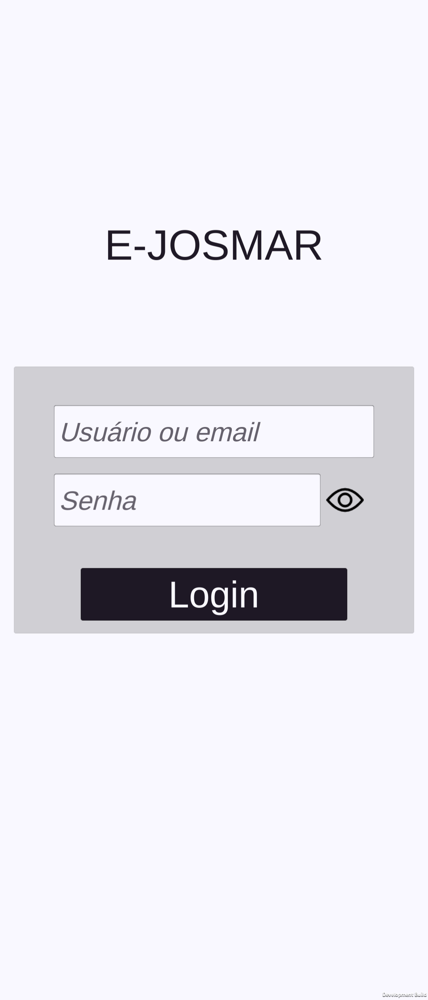
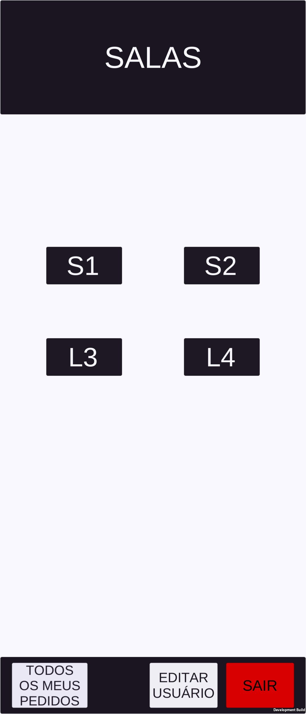
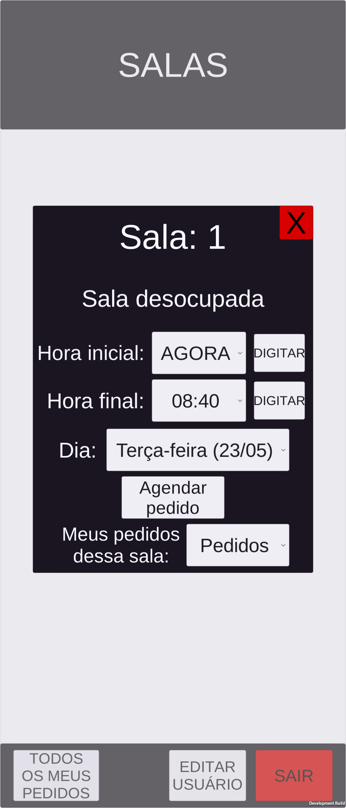
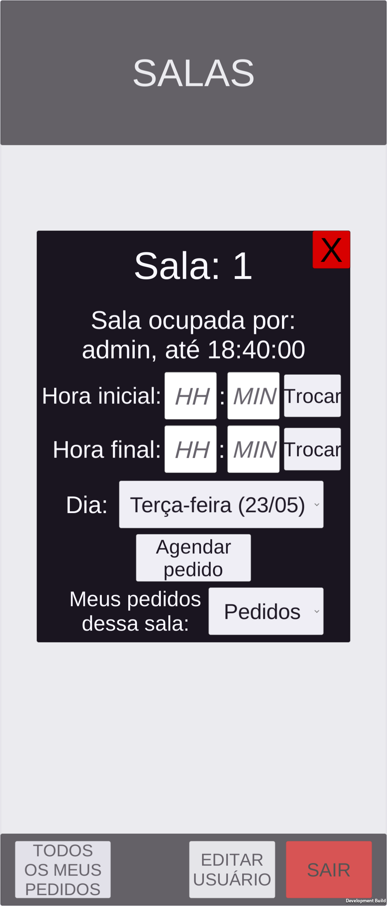
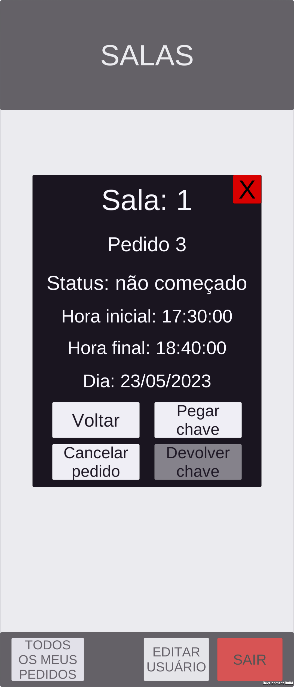

# Aplicativo e-josmar

Esse é o repositório dos scripts do aplicativo e-josmar para celulares que foi feito na plataforma Unity.

Ele se comunica com a API [server-josmar](https://github.com/mocno/server-josmar) e armário "e-josmar".

---
## Imagens do aplicativo
### Login

---
### Vizualização das salas
- Exemplo com 2 salas (S1 e S2) e 2 laboratórios (L1 e L2)

---
### Vizualização de uma sala específica
- É possível fazer pedidos pelas salas, de acordo com a disponibilidade de horário

---
### Situação de um pedido

